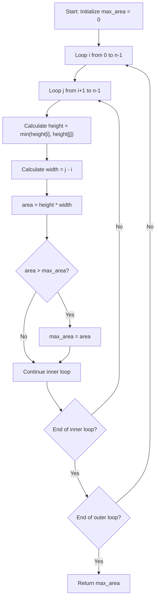

<h2><a href="https://leetcode.com/problems/container-with-most-water">11. Container With Most Water</a></h2>

<p>You are given an integer array <code>height</code> of length <code>n</code>. There are <code>n</code> vertical lines drawn such that the two endpoints of the <code>i<sup>th</sup></code> line are <code>(i, 0)</code> and <code>(i, height[i])</code>.</p>

<p>Find two lines that together with the x-axis form a container, such that the container contains the most water.</p>

<p>Return <em>the maximum amount of water a container can store</em>.</p>

<p><strong>Notice</strong> that you may not slant the container.</p>

<p>&nbsp;</p>
<p><strong class="example">Example 1:</strong></p>

<pre><strong>Input:</strong> height = [1,8,6,2,5,4,8,3,7]
<strong>Output:</strong> 49
<strong>Explanation:</strong> The above vertical lines are represented by array [1,8,6,2,5,4,8,3,7]. In this case, the max area of water (blue section) the container can contain is 49.
</pre>

<p><strong class="example">Example 2:</strong></p>

<pre><strong>Input:</strong> height = [1,1]
<strong>Output:</strong> 1
</pre>

<p>&nbsp;</p>
<p><strong>Constraints:</strong></p>

<ul>
	<li><code>n == height.length</code></li>
	<li><code>2 &lt;= n &lt;= 10<sup>5</sup></code></li>
	<li><code>0 &lt;= height[i] &lt;= 10<sup>4</sup></code></li>
</ul>


---

# 🛍️ Container-With-Most-Water | Explained

## Approach 1: Brute Force (Nested Loops)
### Intuition
Imagine you have a series of vertical walls of varying heights standing in a line, and you want to choose two walls to hold water between them. The amount of water the pair can hold depends on two factors: the distance between the two walls (width) and the height of the shorter wall (since water would spill over if filled past the shorter wall's height). 

This approach systematically tests every possible pair of walls to measure the water capacity of each combination and keeps track of the maximum capacity found.

### Algorithm Visualized


### Approach
1. Determine the number of elements $n$ in the input list `height`.
2. Maintain a running maximum area variable (`marea`), initialized to `0`.
3. Use a nested loop to check every unique pair of indices $(i, j)$ where $i < j$:
   - The outer loop variable `i` represents the left boundary index.
   - The inner loop variable `j` represents the right boundary index, starting at `i + 1`.
4. For each pair $(i, j)$:
   - Compute the bottleneck height using `min(height[i], height[j])`.
   - Compute the width as `j - i`.
   - Calculate the area as `bottleneck height * width`.
   - Compare the calculated area with `marea` and update `marea` if the current area is strictly greater.
5. Return `marea` after all pairs have been evaluated.

### Detailed Code Analysis
- **Line 3 (`n=len(height)`):** Calculates the total number of vertical lines in the list and stores it in variable `n`.
- **Line 4 (`marea=0`):** Initializes `marea` (max area) to `0`, which will track the largest container area found so far.
- **Line 5 (`for i in range(0,n):`):** Starts the outer loop, iterating through each possible left wall index `i` from index `0` up to `n-1`.
- **Line 6 (`for j in range(i+1,n):`):** Starts the inner loop, iterating through each possible right wall index `j` starting from `i+1` to `n-1` to avoid comparing a line with itself or re-evaluating duplicate pairs.
- **Line 7 (`area = (min(height[i],height[j])) * (j-i)`):** Computes the container area for the boundary pair `(i, j)`. `min(height[i], height[j])` determines the maximum effective height of the water, while `(j - i)` determines the distance between the lines.
- **Lines 8–9 (`if area > marea: marea = area`):** Checks if the current container holds more water than the recorded maximum. If it does, updates `marea` to store this new maximum.
- **Line 11 (`return marea`):** Returns the overall maximum area after evaluating all $O(n^2)$ pairs.

### Code
```python
class Solution:
    def maxArea(self, height: List[int]) -> int:
        n=len(height)
        marea=0
        for i in range(0,n):
            for j in range(i+1,n):
                area = (min(height[i],height[j])) * (j-i)
                if area > marea :
                    marea = area
                
        return marea
```

### Complexity
- **Time:** $\mathcal{O}(n^2)$ — The nested loops check every possible pair $(i, j)$. Total pairs evaluated equal $\frac{n(n-1)}{2}$, leading to quadratic time complexity, which will result in a Time Limit Exceeded (TLE) status on large inputs in LeetCode.
- **Space:** $\mathcal{O}(1)$ — Only a constant number of variables (`n`, `marea`, `i`, `j`, `area`) are used, requiring no additional storage space proportional to input size.

## 🕵️‍♂️ Follow-up Questions (Optional)

**Q: How can we optimize this solution to $\mathcal{O}(n)$ time complexity?**
*A:* We can use the **Two-Pointer Technique**. Place one pointer at the start (`left = 0`) and one at the end (`right = len(height) - 1`). Compute the area at each step, update the max area, and then move the pointer pointing to the shorter line inward. Moving the taller line inward could never yield a larger area because the width decreases while the height remains constrained by the shorter line.

**Q: Why does moving the shorter line pointer guarantee we won't miss the optimal solution?**
*A:* The container area is limited by `min(height[left], height[right]) * (right - left)`. If we keep the shorter line and move the taller line, the width decreases, and the height can never exceed `height[shorter]`. Thus, all other candidate pairs involving the current shorter line will strictly yield smaller areas. Therefore, discarding the shorter line is mathematically safe.