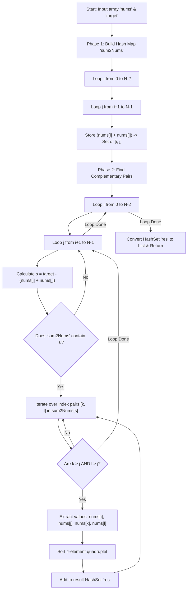

<h2><a href="https://leetcode.com/problems/4sum">18. 4Sum</a></h2>

<p>Given an array <code>nums</code> of <code>n</code> integers, return <em>an array of all the <strong>unique</strong> quadruplets</em> <code>[nums[a], nums[b], nums[c], nums[d]]</code> such that:</p>

<ul>
	<li><code>0 &lt;= a, b, c, d&nbsp;&lt; n</code></li>
	<li><code>a</code>, <code>b</code>, <code>c</code>, and <code>d</code> are <strong>distinct</strong>.</li>
	<li><code>nums[a] + nums[b] + nums[c] + nums[d] == target</code></li>
</ul>

<p>You may return the answer in <strong>any order</strong>.</p>

<p>&nbsp;</p>
<p><strong class="example">Example 1:</strong></p>

<pre><strong>Input:</strong> nums = [1,0,-1,0,-2,2], target = 0
<strong>Output:</strong> [[-2,-1,1,2],[-2,0,0,2],[-1,0,0,1]]
</pre>

<p><strong class="example">Example 2:</strong></p>

<pre><strong>Input:</strong> nums = [2,2,2,2,2], target = 8
<strong>Output:</strong> [[2,2,2,2]]
</pre>

<p>&nbsp;</p>
<p><strong>Constraints:</strong></p>

<ul>
	<li><code>1 &lt;= nums.length &lt;= 200</code></li>
	<li><code>-10<sup>9</sup> &lt;= nums[i] &lt;= 10<sup>9</sup></code></li>
	<li><code>-10<sup>9</sup> &lt;= target &lt;= 10<sup>9</sup></code></li>
</ul>


---

# 🛍️ 4Sum | Explained

## Approach 1: Pair-Sum Hash Map Precomputation

### Intuition
Imagine you are organizing a double date for 4 people from a group, where the sum of their budget contributions must equal an exact target amount. Instead of testing every possible group of 4 people one by one, you divide the work into pairs. 

First, you pair up every possible duo, calculate their combined budget, and write down their names (indices) on a master list indexed by that combined budget. Then, you loop through every possible duo again and check your master list: *"Is there another duo whose budget exactly complements ours to reach the target?"* To ensure no single person is placed in both duos and to avoid duplicate groups, you only consider matching duos that were indexed strictly after your current duo.

### Algorithm Visualized



### Approach
1. **Precomputation (Phase 1):** Iterate through all unique index pairs $(i, j)$ where $i < j$. Compute their sum `nums[i] + nums[j]` and store the pair of indices `[i, j]` in a Hash Map (`sum2Nums`) mapping from `Sum -> Set of Index Pairs`.
2. **Complement Search (Phase 2):** Iterate through all index pairs $(i, j)$ again. Calculate the required complementary sum `s = target - (nums[i] + nums[j])`.
3. **Index Disjointness & Ordering Check:** If `s` exists in the map, iterate over all cached index pairs `[k, l]`. To prevent using the same array index twice and to eliminate structural index permutations, enforce the strict relative ordering $i < j < k < l$ by checking `k > j && l > j`.
4. **Value Deduplication:** Collect the 4 values `[nums[i], nums[j], nums[k], nums[l]]`. Because the input array is not pre-sorted, identical values at different indices could produce the same quadruplet in different orderings. Sort the 4-element list and insert it into a `Set<List<Integer>>` to guarantee value uniqueness.
5. **Return:** Convert the result set into a list of lists.

### Detailed Code Analysis

```java
public List<List<Integer>> fourSum(int[] nums, int target) {
    // HashSet ensures duplicate quadruplets (same values) are automatically filtered out
    Set<List<Integer>> res = new HashSet<>();
    int len = nums.length;
    
    // Hash map to store pair sums and their corresponding pair indices [i, j]
    Map<Integer, Set<List<Integer>>> sum2Nums = new HashMap<>();
    
    // Phase 1: Precompute all 2-sum combinations and store their index pairs
    for (int i = 0; i < len - 1; i++) {
        for (int j = i + 1; j < len; j++) {
            // computeIfAbsent creates a new HashSet if the key doesn't exist yet
            sum2Nums.computeIfAbsent(nums[i] + nums[j], k -> new HashSet<>()).add(Arrays.asList(i, j));
        }
    }
    
    // Phase 2: Find pairs whose sum complements the current pair to match 'target'
    for (int i = 0; i < len - 1; i++) {
        for (int j = i + 1; j < len; j++) {
            int s = target - (nums[i] + nums[j]);
            
            if (sum2Nums.containsKey(s)) {
                for (List<Integer> kl : sum2Nums.get(s)) {
                    // Strict index ordering check: ensures i < j < k < l
                    // This prevents index reuse and avoids identical index set permutations
                    if (kl.get(0) > j && kl.get(1) > j) {
                        List<Integer> quard = Arrays.asList(nums[i], nums[j], nums[kl.get(0)], nums[kl.get(1)]);
                        
                        // Sort the 4 elements to canonicalize ordering for HashSet deduplication
                        Collections.sort(quard);
                        res.add(quard);
                    }
                }
            }
        }
    }
    
    return new ArrayList<>(res);
}
```

### Code
```java
public List<List<Integer>> fourSum(int[] nums, int target) {
    Set<List<Integer>> res = new HashSet<>();
    int len = nums.length;
    
    Map<Integer, Set<List<Integer>>> sum2Nums = new HashMap<>();
    for (int i = 0; i < len - 1; i++) {
        for (int j = i + 1; j < len; j++) {
            sum2Nums.computeIfAbsent(nums[i] + nums[j], k -> new HashSet<>()).add(Arrays.asList(i, j));
        }
    }
    for (int i = 0; i < len - 1; i++) {
        for (int j = i + 1; j < len; j++) {
            int s = target - (nums[i] + nums[j]);
            if (sum2Nums.containsKey(s)) {
                for (List<Integer> kl : sum2Nums.get(s)) {
                    if (kl.get(0) > j && kl.get(1) > j) {
                        List<Integer> quard = Arrays.asList(nums[i], nums[j], nums[kl.get(0)], nums[kl.get(1)]);
                        Collections.sort(quard);
                        res.add(quard);
                    }
                }
            }
        }
    }
    return new ArrayList<>(res);
}
```

### Complexity
- **Time Complexity:** 
  - **Average Case:** $O(N^2)$ to $O(N^3)$. Generating pairs takes $O(N^2)$. If array values are well-distributed, `sum2Nums.get(s)` returns a small number of pairs, keeping the lookup phase close to $O(N^2)$.
  - **Worst Case:** $O(N^4)$. If many elements are identical (e.g., `nums = [0, 0, 0, ... 0]`), $O(N^2)$ pair combinations will produce the exact same sum. The inner loop over `sum2Nums.get(s)` will run $O(N^2)$ times for each of the $O(N^2)$ outer pairs, degrading performance to $O(N^4)$.
  - Sorting each 4-element quadruplet takes $O(4 \log 4) = O(1)$ time.

- **Space Complexity:** $O(N^2)$ extra space.
  - There are $\frac{N(N-1)}{2} = O(N^2)$ total pair combinations stored in the `sum2Nums` Hash Map.
  - The result set `res` can store up to $O(N^3)$ quadruplets in the worst case.

---

## 🕵️‍♂️ Follow-up Questions

### 1. How can we optimize the space complexity to $O(1)$ extra space while guaranteeing $O(N^3)$ worst-case time complexity?
**Answer:** Sort the input array `nums` first. Fix two numbers using two nested loops (`i` and `j`), and use a classic **Two-Pointer** technique (`left = j + 1`, `right = len - 1`) for the remaining two numbers. Skip duplicate elements directly inside the loops to avoid using a `HashSet`.

### 2. Is there a subtle Integer Overflow bug in this implementation?
**Answer:** Yes. In modern LeetCode test cases, values in `nums` can be up to $10^9$ and target can be up to $10^9$. Adding two integers like `nums[i] + nums[j]` or calculating `target - (nums[i] + nums[j])` can exceed 32-bit integer limits (`Integer.MAX_VALUE = 2,147,483,647`), causing arithmetic overflow. To fix this, casting intermediate sums to `long` is necessary:
```java
long sum = (long) nums[i] + nums[j];
long complement = (long) target - sum;
```