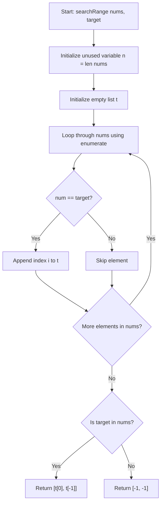

<h2><a href="https://leetcode.com/problems/find-first-and-last-position-of-element-in-sorted-array">34. Find First and Last Position of Element in Sorted Array</a></h2>

<p>Given an array of integers <code>nums</code> sorted in non-decreasing order, find the starting and ending position of a given <code>target</code> value.</p>

<p>If <code>target</code> is not found in the array, return <code>[-1, -1]</code>.</p>

<p>You must&nbsp;write an algorithm with&nbsp;<code>O(log n)</code> runtime complexity.</p>

<p>&nbsp;</p>
<p><strong class="example">Example 1:</strong></p>
<pre><strong>Input:</strong> nums = [5,7,7,8,8,10], target = 8
<strong>Output:</strong> [3,4]
</pre><p><strong class="example">Example 2:</strong></p>
<pre><strong>Input:</strong> nums = [5,7,7,8,8,10], target = 6
<strong>Output:</strong> [-1,-1]
</pre><p><strong class="example">Example 3:</strong></p>
<pre><strong>Input:</strong> nums = [], target = 0
<strong>Output:</strong> [-1,-1]
</pre>
<p>&nbsp;</p>
<p><strong>Constraints:</strong></p>

<ul>
	<li><code>0 &lt;= nums.length &lt;= 10<sup>5</sup></code></li>
	<li><code>-10<sup>9</sup>&nbsp;&lt;= nums[i]&nbsp;&lt;= 10<sup>9</sup></code></li>
	<li><code>nums</code> is a non-decreasing array.</li>
	<li><code>-10<sup>9</sup>&nbsp;&lt;= target&nbsp;&lt;= 10<sup>9</sup></code></li>
</ul>


---

# 🛍️ Find-First-and-Last-Position-of-Element-in-Sorted-Array | Explained

## Approach 1: Linear Scan with Index Tracking
### Intuition
Imagine you have a row of numbered boxes on a table, and you are asked to find the first and last position of a specific item. Instead of taking advantage of the fact that the items are already sorted, you inspect every single box one by one from left to right. Every time you see the target item, you write down the box number in a notebook. 

Once you reach the end, if you wrote anything in your notebook, you simply read off the first entry and the last entry. If the notebook is empty, you declare the item missing by returning `[-1, -1]`.

### Algorithm Visualized


### Approach
1. Compute the length of `nums` and store it in variable `n` (though `n` is never referenced again).
2. Initialize an empty list `t` to collect the indices of all elements equal to `target`.
3. Iterate through `nums` using `enumerate` to get both the index `i` and value `num`.
4. If `num == target`, append the current index `i` to list `t`.
5. After the loop, check if `target in nums` (a second linear scan across `nums`).
6. If `target` exists in `nums`, return the first element `t[0]` and last element `t[-1]` as a two-element list.
7. Otherwise, return `[-1, -1]`.

### Detailed Code Analysis
- **Line 3 (`n=len(nums)`):** Calculates the total length of the input list `nums`. This variable is never utilized in the rest of the function (dead code).
- **Line 4 (`t=[]`):** Allocates a dynamic array/list `t` in memory to store matching target indices.
- **Lines 5–7 (`for i,num in enumerate(nums): if num == target: t.append(i)`):** Performs an $O(N)$ linear pass over `nums`. For every match, `t.append(i)` adds the current index to `t`.
- **Line 8 (`if target in nums:`):** Performs a membership test in Python. Because `nums` is a standard `list`, this triggers an additional full $O(N)$ linear search through `nums` from start to finish.
- **Line 9 (`return [t[0],t[-1]]`):** Retrieves `t[0]` (the index of the first occurrence) and `t[-1]` (the index of the last occurrence) using Python's positive and negative indexing.
- **Lines 10–11 (`else: return [-1,-1]`):** Handles the edge case where `target` is not present in `nums`.

### Code
```python
class Solution:
    def searchRange(self, nums: List[int], target: int) -> List[int]:
        n = len(nums)
        t = []
        for i, num in enumerate(nums):
            if num == target:
                t.append(i)
        if target in nums:
            return [t[0], t[-1]]
        else:
            return [-1, -1]
```

### Complexity
- **Time Complexity:** $\mathcal{O}(N)$
  - The loop iterates through all $N$ elements in `nums` once: $\mathcal{O}(N)$.
  - The expression `target in nums` iterates through `nums` again until it finds `target` or hits the end: $\mathcal{O}(N)$.
  - Total time: $\mathcal{O}(N) + \mathcal{O}(N) = \mathcal{O}(N)$. This does not meet the optimal LeetCode constraint requiring an $\mathcal{O}(\log N)$ algorithm.
- **Space Complexity:** $\mathcal{O}(N)$
  - In the worst case (where all elements in `nums` are equal to `target`), the list `t` will store $N$ indices, taking $\mathcal{O}(N)$ extra auxiliary space.

---

## 🕵️‍♂️ Follow-up Questions

### 1. How can this solution be optimized to satisfy the $O(\log N)$ time complexity requirement?
Because the input array `nums` is already **sorted**, we can perform two separate Binary Searches:
1. **First Binary Search:** Find the leftmost boundary (lower bound) where `nums[mid] == target`.
2. **Second Binary Search:** Find the rightmost boundary (upper bound) where `nums[mid] == target`.

This reduces the time complexity from $\mathcal{O}(N)$ to $\mathcal{O}(\log N)$ and space complexity from $\mathcal{O}(N)$ to $\mathcal{O}(1)$.

### 2. What code smells/inefficiencies exist in the current implementation?
- **Unused Variable:** Variable `n` on Line 3 is assigned but never used.
- **Redundant Linear Search:** Line 8 (`if target in nums:`) performs an extra $\mathcal{O}(N)$ search. Instead, checking `if len(t) > 0:` or `if t:` evaluates in $\mathcal{O}(1)$ time using the already populated list `t`.
- **Unnecessary Memory Allocation:** Storing every index in `t` consumes extra memory. If keeping a linear scan, tracking only two integer variables (`first = -1`, `last = -1`) would reduce space usage to $\mathcal{O}(1)$.