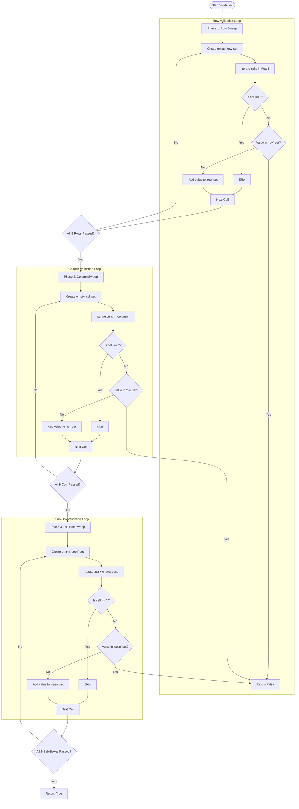

<h2><a href="https://leetcode.com/problems/valid-sudoku">36. Valid Sudoku</a></h2>

<p>Determine if a&nbsp;<code>9 x 9</code> Sudoku board&nbsp;is valid.&nbsp;Only the filled cells need to be validated&nbsp;<strong>according to the following rules</strong>:</p>

<ol>
	<li>Each row&nbsp;must contain the&nbsp;digits&nbsp;<code>1-9</code> without repetition.</li>
	<li>Each column must contain the digits&nbsp;<code>1-9</code>&nbsp;without repetition.</li>
	<li>Each of the nine&nbsp;<code>3 x 3</code> sub-boxes of the grid must contain the digits&nbsp;<code>1-9</code>&nbsp;without repetition.</li>
</ol>

<p><strong>Note:</strong></p>

<ul>
	<li>A Sudoku board (partially filled) could be valid but is not necessarily solvable.</li>
	<li>Only the filled cells need to be validated according to the mentioned&nbsp;rules.</li>
</ul>

<p>&nbsp;</p>
<p><strong class="example">Example 1:</strong></p>

<pre><strong>Input:</strong> board = 
[["5","3",".",".","7",".",".",".","."]
,["6",".",".","1","9","5",".",".","."]
,[".","9","8",".",".",".",".","6","."]
,["8",".",".",".","6",".",".",".","3"]
,["4",".",".","8",".","3",".",".","1"]
,["7",".",".",".","2",".",".",".","6"]
,[".","6",".",".",".",".","2","8","."]
,[".",".",".","4","1","9",".",".","5"]
,[".",".",".",".","8",".",".","7","9"]]
<strong>Output:</strong> true
</pre>

<p><strong class="example">Example 2:</strong></p>

<pre><strong>Input:</strong> board = 
[["8","3",".",".","7",".",".",".","."]
,["6",".",".","1","9","5",".",".","."]
,[".","9","8",".",".",".",".","6","."]
,["8",".",".",".","6",".",".",".","3"]
,["4",".",".","8",".","3",".",".","1"]
,["7",".",".",".","2",".",".",".","6"]
,[".","6",".",".",".",".","2","8","."]
,[".",".",".","4","1","9",".",".","5"]
,[".",".",".",".","8",".",".","7","9"]]
<strong>Output:</strong> false
<strong>Explanation:</strong> Same as Example 1, except with the <strong>5</strong> in the top left corner being modified to <strong>8</strong>. Since there are two 8's in the top left 3x3 sub-box, it is invalid.
</pre>

<p>&nbsp;</p>
<p><strong>Constraints:</strong></p>

<ul>
	<li><code>board.length == 9</code></li>
	<li><code>board[i].length == 9</code></li>
	<li><code>board[i][j]</code> is a digit <code>1-9</code> or <code>'.'</code>.</li>
</ul>


---

# 🛍️ Valid-Sudoku | Explained

## Approach 1: Three-Pass Independent Region Validation (Iterative Hash Sets)

### Intuition
Imagine a quality inspector checking a $9 \times 9$ Sudoku grid. To guarantee the board's validity, the inspector must enforce three rules:
1. Every horizontal row contains unique numbers ($1-9$).
2. Every vertical column contains unique numbers ($1-9$).
3. Each of the nine $3 \times 3$ sub-boxes contains unique numbers ($1-9$).

Instead of attempting to track all three rules simultaneously in a single complex state, this approach breaks down the validation process into three distinct, easy-to-read sequential sweeps:
- Sweep 1 verifies row integrity.
- Sweep 2 verifies column integrity.
- Sweep 3 verifies sub-grid integrity.

During each sweep, an empty notepad (a Python `set`) is used per section to write down numbers observed so far. If a number is encountered that is already on the notepad, a duplicate exists, and the board is immediately declared invalid. Empty slots represented by standard string dots (`'.'`) are skipped.

### Algorithm Visualized



---

### Approach
1. **Initialize Constraints**: Define $n = 9$ representing board dimensions.
2. **Row Check (Sweep 1)**:
   - Loop $i$ from $0$ to $8$ for each row.
   - For every row $i$, re-instantiate a fresh set `row`.
   - Traverse column index $j$ from $0$ to $8$. Skip empty slots (`'.'`).
   - If `board[i][j]` exists in `row`, return `False`.
   - Otherwise, insert `board[i][j]` into `row`.
3. **Column Check (Sweep 2)**:
   - Loop $j$ from $0$ to $8$ for each column.
   - For every column $j$, re-instantiate a fresh set `col`.
   - Traverse row index $i$ from $0$ to $8$. Skip empty slots (`'.'`).
   - If `board[i][j]` exists in `col`, return `False`.
   - Otherwise, insert `board[i][j]` into `col`.
4. **Sub-Grid Check (Sweep 3)**:
   - Use step sizes of $3$ (`range(0, 9, 3)`) to iterate over the top-left starting corner `(row, col)` of each $3 \times 3$ sub-box.
   - Re-instantiate a fresh set `seen` for each sub-box.
   - Traverse relative row indices $i \in [\text{row}, \text{row} + 3)$ and column indices $j \in [\text{col}, \text{col} + 3)$.
   - Skip empty slots (`'.'`). Check for duplicates using `seen`.
5. **Final Result**: If no duplicate is detected across all three phases, return `True`.

---

### Detailed Code Analysis

*(Note: In your original implementation, lines 8, 19, and 31 had a minor syntax issue using raw `.` instead of string literal `'.'`. The analysis below reflects the corrected string character comparison).*

#### Phase 1: Row Validation (Lines 4–14)
* **Line 4:** `n = 9` sets the size constant.
* **Line 5:** `for i in range(0, n):` initiates the outer row loop.
* **Line 6:** `row = set()` resets the hash set per row. This ensures numbers from Row 0 do not poison comparisons in Row 1.
* **Line 7:** `for j in range(0, n):` steps horizontally through each element of row $i$.
* **Lines 8–9:** `if board[i][j] == '.': continue` skips unfilled board positions.
* **Lines 10–11:** `if board[i][j] in row: return False` checks $O(1)$ set membership. If already seen, early termination occurs.
* **Line 13:** `row.add(board[i][j])` records the current number in the set.

#### Phase 2: Column Validation (Lines 16–25)
* **Line 16:** `for j in range(0, n):` sets the outer loop to index columns.
* **Line 17:** `col = set()` creates an isolated hash set per column.
* **Line 18:** `for i in range(0, n):` steps vertically down column $j$.
* **Lines 19–24:** Applies the identical set checking logic transposed for vertical traversal (`board[i][j]`).

#### Phase 3: $3 \times 3$ Box Validation (Lines 26–35)
* **Lines 26–27:** `for row in range(0, 9, 3):` and `for col in range(0, 9, 3):` create a 2D stride of $3$. This targets sub-box origins at coordinates $(0,0), (0,3), (0,6), (3,0), \dots, (6,6)$.
* **Line 28:** `seen = set()` initializes a container for the $3 \times 3$ matrix section.
* **Lines 29–30:** `for i in range(row, row + 3):` and `for j in range(col, col + 3):` bound the inner loops tightly inside the current $3 \times 3$ window.
* **Lines 31–35:** Performs $O(1)$ duplicate lookup using `seen` on the local sub-box region.

#### Completion (Line 39)
* **Line 39:** `return True` indicates all three phases executed without finding duplicate values.

---

### Code

```python
from typing import List

class Solution:
    def isValidSudoku(self, board: List[List[str]]) -> bool:
        n = 9
        
        # Phase 1: Validate Rows
        for i in range(0, n):
            row = set()
            for j in range(0, n):
                if board[i][j] == '.':
                    continue
                if board[i][j] in row:
                    return False
                row.add(board[i][j])
                
        # Phase 2: Validate Columns
        for j in range(0, n):
            col = set()
            for i in range(0, n):
                if board[i][j] == '.':
                    continue
                if board[i][j] in col:
                    return False
                col.add(board[i][j])

        # Phase 3: Validate 3x3 Sub-boxes
        for row in range(0, 9, 3):
            for col in range(0, 9, 3):
                seen = set()
                for i in range(row, row + 3):
                    for j in range(col, col + 3):
                        if board[i][j] == '.':
                            continue
                        if board[i][j] in seen:
                            return False
                        seen.add(board[i][j])          

        return True
```

---

### Complexity

- **Time Complexity:** $\mathcal{O}(1)$ (or $\mathcal{O}(N^2)$ for generalized $N \times N$ board size).
  - The standard board is fixed at $9 \times 9 = 81$ cells.
  - Phase 1 visits 81 cells, Phase 2 visits 81 cells, Phase 3 visits 81 cells.
  - Total operations $= 3 \times 81 = 243$ cell checks with $O(1)$ hash set lookup times. Because the board size is constant, runtime complexity is strictly bounded by $\mathcal{O}(1)$.

- **Space Complexity:** $\mathcal{O}(1)$ (or $\mathcal{O}(N)$ auxiliary space for generalized $N \times N$).
  - At any single moment, each hash set (`row`, `col`, or `seen`) holds a maximum of $9$ distinct string elements.
  - Sets are garbage-collected or re-allocated per iteration loop. Max memory allocated at any given point is $O(9) \implies \mathcal{O}(1)$.

---

## 🕵️‍♂️ Follow-up Questions

### 1. How can we optimize this solution to validate the entire board in a single pass instead of three?
**Answer:** We can track seen numbers for rows, columns, and sub-boxes simultaneously inside a single nested loop using either array hash-maps or unique encoding in a single hash set. 

For instance, sub-box coordinates can be derived mathematically using integer division: `box_index = (i // 3) * 3 + (j // 3)`. We can maintain three 2D collections of boolean flags or sets (`rows[9]`, `cols[9]`, `boxes[9]`) and validate all three rules for cell `(i, j)` in one traversal.

### 2. Can we eliminate hash sets entirely to achieve true $O(1)$ space with zero object allocations?
**Answer:** Yes, by using **Bit Manipulation**. Since digits are limited from `'1'` to `'9'`, an integer bitmask can represent seen values. The $k$-th bit of an integer `mask` represents whether number $k$ has been seen.
- Check if seen: `(mask & (1 << digit)) != 0`
- Mark as seen: `mask |= (1 << digit)`

Using an array of 9 integer bitmasks for rows, columns, and boxes provides optimal memory efficiency with zero dynamic overhead.