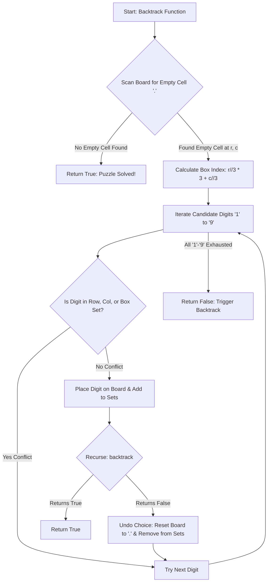

<h2><a href="https://leetcode.com/problems/sudoku-solver">37. Sudoku Solver</a></h2>

<p>Write a program to solve a Sudoku puzzle by filling the empty cells.</p>

<p>A sudoku solution must satisfy <strong>all of the following rules</strong>:</p>

<ol>
	<li>Each of the digits <code>1-9</code> must occur exactly once in each row.</li>
	<li>Each of the digits <code>1-9</code> must occur exactly once in each column.</li>
	<li>Each of the digits <code>1-9</code> must occur exactly once in each of the 9 <code>3x3</code> sub-boxes of the grid.</li>
</ol>

<p>The <code>'.'</code> character indicates empty cells.</p>

<p>&nbsp;</p>
<p><strong class="example">Example 1:</strong></p>

<pre><strong>Input:</strong> board = [["5","3",".",".","7",".",".",".","."],["6",".",".","1","9","5",".",".","."],[".","9","8",".",".",".",".","6","."],["8",".",".",".","6",".",".",".","3"],["4",".",".","8",".","3",".",".","1"],["7",".",".",".","2",".",".",".","6"],[".","6",".",".",".",".","2","8","."],[".",".",".","4","1","9",".",".","5"],[".",".",".",".","8",".",".","7","9"]]
<strong>Output:</strong> [["5","3","4","6","7","8","9","1","2"],["6","7","2","1","9","5","3","4","8"],["1","9","8","3","4","2","5","6","7"],["8","5","9","7","6","1","4","2","3"],["4","2","6","8","5","3","7","9","1"],["7","1","3","9","2","4","8","5","6"],["9","6","1","5","3","7","2","8","4"],["2","8","7","4","1","9","6","3","5"],["3","4","5","2","8","6","1","7","9"]]
<strong>Explanation:</strong>&nbsp;The input board is shown above and the only valid solution is shown below:


</pre>

<p>&nbsp;</p>
<p><strong>Constraints:</strong></p>

<ul>
	<li><code>board.length == 9</code></li>
	<li><code>board[i].length == 9</code></li>
	<li><code>board[i][j]</code> is a digit or <code>'.'</code>.</li>
	<li>It is <strong>guaranteed</strong> that the input board has only one solution.</li>
</ul>


---

# 🛍️ Sudoku-Solver | Explained

## Approach 1: Backtracking with Hash Sets

### Intuition
Solving a Sudoku puzzle programmatically is conceptually similar to solving one on paper using a pencil and an eraser. When you fill in an empty cell, you choose a number between `1` and `9` that does not conflict with any existing numbers in the same row, column, or $3 \times 3$ subgrid. If you proceed further and hit a dead end (a square where no numbers from `1` to `9` can legally be placed), you erase your recent choices, go back to the previous decision point, and try the next available number.

To quickly check whether a number is valid without scanning the $9 \times 9$ grid every single time, we maintain three lookup systems (hash sets): one set per row, one per column, and one per $3 \times 3$ box.

### Algorithm Visualized



### Approach
1. **Initialize State Trackers**: Create three collections of 9 hash sets each (`rows`, `cols`, `boxes`). These keep track of the numbers already present in each row, column, and $3 \times 3$ subgrid.
2. **Pre-populate Constraints**: Iterate through the initial $9 \times 9$ board. For every non-empty cell containing a digit, record that digit in its corresponding row set, column set, and box set.
   - The $3 \times 3$ box index is calculated using the formula: `box_index = (r // 3) * 3 + (c // 3)`.
3. **Recursive Backtracking**:
   - Traverse the board to find an empty cell (represented by `'.'`).
   - If no empty cell remains, the board is completely and correctly filled—return `True`.
   - For an empty cell at $(r, c)$, loop through character digits `'1'` through `'9'`.
   - Check if the digit is absent from `rows[r]`, `cols[c]`, and `boxes[box]`.
   - **Make Choice**: Place the digit on the board and add it to the three corresponding sets.
   - **Explore**: Recursively call `backtrack()`. If it returns `True`, return `True` up the call stack.
   - **Undo Choice (Backtrack)**: If the recursive call returns `False`, remove the digit from the sets and reset the board cell back to `'.'`.
   - If none of the numbers from `'1'` to `'9'` result in a valid grid, return `False` to backtrack to the previous cell.

### Detailed Code Analysis

- **Lines 3–5**: `rows`, `cols`, `boxes` are initialized as lists of 9 empty `set()` instances. Hash sets provide $O(1)$ average time complexity for insertions, deletions, and lookup operations, eliminating the need to iterate through full rows/cols/boxes to check validity.
- **Lines 8–14**: Pre-computation pass. We loop through all 81 cells of the grid. When a cell contains an initial number (i.e., `board[r][c] != '.'`), we insert that digit into `rows[r]`, `cols[c]`, and `boxes[(r // 3) * 3 + (c // 3)]`.
- **Line 16**: Definition of the helper `backtrack()` closure function, which captures `rows`, `cols`, `boxes`, and `board` in its scope.
- **Lines 17–19**: Outer loops scan the board row-by-row and column-by-column to locate the next empty slot `board[r][c] == '.'`.
- **Line 20**: Map the 2D cell coordinate $(r, c)$ to one of the 9 subgrid box indices ($0$ through $8$).
- **Lines 22–27**: Iterate over candidate characters `'1'` through `'9'`. The `if` condition verifies constraint satisfaction across all three scope boundaries in $O(1)$ time.
- **Lines 28–31**: State mutation—we write the candidate digit to the board and register it into all three constraint sets.
- **Lines 33–34**: Recursive step. If downstream cells can be successfully solved, we immediately propagate `True` upward to terminate early.
- **Lines 37–40**: Backtracking step. If downstream exploration failed, we revert the board cell back to `'.'` and clean up our constraint sets so subsequent candidates can be tested cleanly.
- **Line 42**: Returns `False` when all candidates `'1'`–`'9'` fail for the current empty cell, signaling to the caller frame that an earlier decision was incorrect.
- **Line 43**: Returns `True` when the nested loops finish without finding any empty cell `'.'`.

### Code

```python
from typing import List

class Solution:
    def solveSudoku(self, board: List[List[str]]) -> None:
        rows = [set() for _ in range(9)]
        cols = [set() for _ in range(9)]
        boxes = [set() for _ in range(9)]

        # Fill the sets with existing numbers
        for r in range(9):
            for c in range(9):
                if board[r][c] != '.':
                    rows[r].add(board[r][c])
                    cols[c].add(board[r][c])
                    box = (r // 3) * 3 + (c // 3)
                    boxes[box].add(board[r][c])

        def backtrack() -> bool:
            for r in range(9):
                for c in range(9):
                    if board[r][c] == '.':
                        box = (r // 3) * 3 + (c // 3)

                        for num in "123456789":
                            if (
                                num not in rows[r]
                                and num not in cols[c]
                                and num not in boxes[box]
                            ):
                                board[r][c] = num
                                rows[r].add(num)
                                cols[c].add(num)
                                boxes[box].add(num)

                                if backtrack():
                                    return True

                                # Undo (Backtrack)
                                board[r][c] = '.'
                                rows[r].remove(num)
                                cols[c].remove(num)
                                boxes[box].remove(num)

                        return False
            return True

        backtrack()
```

### Complexity

- **Time Complexity:** $\mathcal{O}(9^M)$, where $M$ is the number of empty cells on the board ($0 \le M \le 81$). In the worst-case scenario without pruning, we explore up to 9 possibilities for each empty cell. Because board dimensions are fixed at $9 \times 9$, the maximum operations are bounded by a constant factor, rendering the execution time $\mathcal{O}(1)$ in standard asymptotic notation.
- **Space Complexity:** $\mathcal{O}(1)$ auxiliary space. The board size is strictly fixed at $9 \times 9 = 81$ cells. The maximum depth of the call stack is 81 frames, and the set trackers hold at most $3 \times 81$ character elements total.

---

## 🕵️‍♂️ Follow-up Questions

### 1. How can we optimize this solution using the Minimum Remaining Values (MRV) heuristic?
Instead of scanning sequentially from top-left to bottom-right for the next empty cell, we can dynamic-select the empty cell that has the **fewest valid candidate numbers** remaining. By picking the cell with the tightest constraints first (i.e., highest degree of constraint), we minimize the branching factor early in the decision tree, causing dead ends to fail fast and drastically reducing unnecessary search paths.

### 2. How can bitmasks replace Hash Sets for lower overhead and $O(1)$ state updates?
Instead of maintaining `List[Set[str]]`, we can represent constraints using 9-bit integers (`int`). 
- Bit $k$ being set to `1` indicates digit $k$ is present.
- Adding a digit: `row_mask |= (1 << digit)`
- Checking availability: `not (row_mask & (1 << digit))`
- Removing a digit: `row_mask &= ~(1 << digit)`

Bitwise bitmasks eliminate heap allocations associated with Python `set` objects and lower CPU cache misses by utilizing direct bitwise registers.