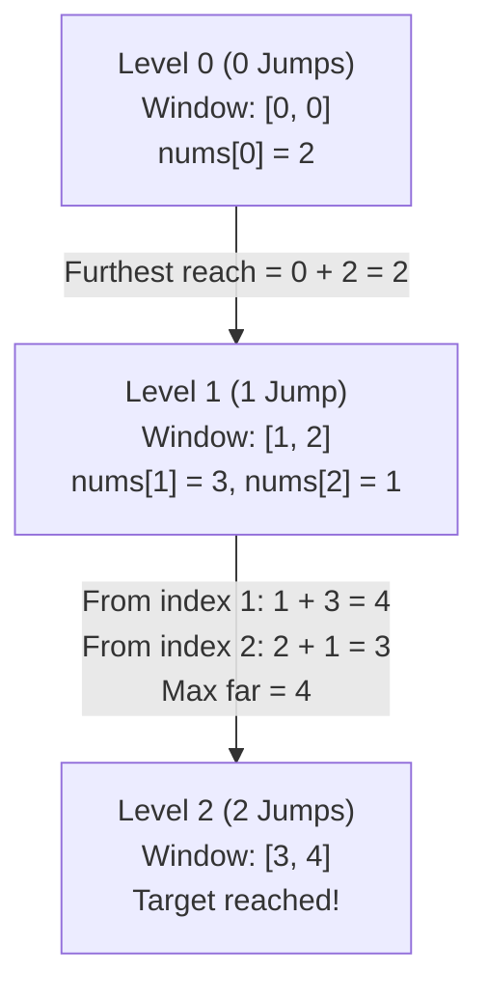

<h2><a href="https://leetcode.com/problems/jump-game-ii">45. Jump Game II</a></h2>

<p>You are given a <strong>0-indexed</strong> array of integers <code>nums</code> of length <code>n</code>. You are initially positioned at&nbsp;index 0.</p>

<p>Each element <code>nums[i]</code> represents the maximum length of a forward jump from index <code>i</code>. In other words, if you are at index <code>i</code>, you can jump to any index <code>(i + j)</code>&nbsp;where:</p>

<ul>
	<li><code>0 &lt;= j &lt;= nums[i]</code> and</li>
	<li><code>i + j &lt; n</code></li>
</ul>

<p>Return <em>the minimum number of jumps to reach index </em><code>n - 1</code>. The test cases are generated such that you can reach index&nbsp;<code>n - 1</code>.</p>

<p>&nbsp;</p>
<p><strong class="example">Example 1:</strong></p>

<pre><strong>Input:</strong> nums = [2,3,1,1,4]
<strong>Output:</strong> 2
<strong>Explanation:</strong> The minimum number of jumps to reach the last index is 2. Jump 1 step from index 0 to 1, then 3 steps to the last index.
</pre>

<p><strong class="example">Example 2:</strong></p>

<pre><strong>Input:</strong> nums = [2,3,0,1,4]
<strong>Output:</strong> 2
</pre>

<p>&nbsp;</p>
<p><strong>Constraints:</strong></p>

<ul>
	<li><code>1 &lt;= nums.length &lt;= 10<sup>4</sup></code></li>
	<li><code>0 &lt;= nums[i] &lt;= 1000</code></li>
	<li>It's guaranteed that you can reach <code>nums[n - 1]</code>.</li>
</ul>


---

# 🛍️ Jump-Game-II | Explained

## Approach 1: Breadth-First Search (BFS) / Greedy Window Expansion

### Intuition
Think of this problem as calculating the minimum number of "waves" or "stages" required to reach a destination. Instead of checking every individual jump path (which would lead to exponential time complexity), we can group our reach into current levels/windows.

Imagine standing at the start line. 
- With **0 jumps**, you can only cover index `0`. This is your initial window: `[0, 0]`.
- From this initial window, you determine the furthest reachable point in the next move. This forms your range for **1 jump**: `[1, far]`.
- From all indices within the **1-jump window**, you scan to find the ultimate furthest point reachable. That creates the boundary for the **2-jump window**, and so on.

By expanding index ranges level-by-level, we effectively perform a Breadth-First Search (BFS) on an implicit graph. The first time our window's upper boundary (`right`) reaches or exceeds the final index (`n - 1`), the current jump count is guaranteed to be the global minimum.

### Algorithm Visualized

For `nums = [2, 3, 1, 1, 4]`:



### Approach
1. **Initialize Boundaries**: Set `left = 0` and `right = 0` to define the start and end of the current jump level. Initialize `jumps = 0`.
2. **Loop Until Goal**: While `right` is less than `n - 1` (meaning we haven't reached the final index yet):
   - Track `far = 0`, representing the furthest index reachable from any position in the current range `[left, right]`.
   - Iterate through every index `i` from `left` to `right` inclusive.
   - For each index `i`, update `far = max(far, i + nums[i])`.
3. **Advance Window**: Once the current range is fully scanned:
   - Shift `left` to `right + 1`.
   - Shift `right` to `far`.
   - Increment `jumps` by `1`.
4. **Return Result**: As soon as `right >= n - 1`, break out of the loop and return `jumps`.

### Detailed Code Analysis

```python
class Solution:
    def jump(self, nums: List[int]) -> int:
        n=len(nums)
        jumps=0
        left=0
        right=0

        while right < n-1:

            far=0

            for i in range(left,right+1):
                far=max(far,i+nums[i])

            left =right+1
            right = far
            jumps+=1
        return jumps
```

- **Lines 3–6 (`n`, `jumps`, `left`, `right`)**: 
  - `n`: Caches array length to avoid repeated calls.
  - `jumps`: Counter tracking the minimum steps taken.
  - `left` & `right`: Pointers establishing the current BFS level boundary `[left, right]`.
- **Line 8 (`while right < n-1:`)**: 
  - Drives the loop until the current reachable window includes or exceeds the last index `n - 1`.
- **Line 10 (`far=0`)**: 
  - Resets the maximum reachable pointer for the upcoming level before scanning the current window.
- **Lines 12–13 (`for i in range(left, right+1): far=max(far, i+nums[i])`)**: 
  - Scans all indices within the current jump level.
  - `i + nums[i]` calculates the absolute index reachable from position `i`.
  - `far` retains the maximum reach found across all candidates in the current window.
- **Lines 15–17 (`left = right + 1`, `right = far`, `jumps += 1`)**: 
  - Moves `left` to the index immediately following the current window.
  - Sets `right` to `far`, extending the reachable range for the next jump.
  - Increments `jumps` to record the jump taken to transition to this new range.
- **Line 18 (`return jumps`)**: 
  - Returns the minimum number of jumps required once `right` reaches or surpasses `n - 1`.

### Code
```python
class Solution:
    def jump(self, nums: List[int]) -> int:
        n = len(nums)
        jumps = 0
        left = 0
        right = 0

        while right < n - 1:
            far = 0
            for i in range(left, right + 1):
                far = max(far, i + nums[i])

            left = right + 1
            right = far
            jumps += 1

        return jumps
```

### Complexity
- **Time Complexity:** $\mathcal{O}(N)$. Although there is a nested loop, notice how the `left` pointer moves strictly forward from `0` to `n - 1`. Every index from `0` to `n - 1` is evaluated inside the inner `for` loop exactly once across all iterations of the `while` loop.
- **Space Complexity:** $\mathcal{O}(1)$. The algorithm only maintains a few integer variables (`n`, `jumps`, `left`, `right`, `far`), requiring constant memory allocation.

---

## 🕵️‍♂️ Follow-up Questions (Optional)

### 1. How would you handle cases where reaching the end is NOT guaranteed?
**Answer:** In the current LeetCode problem, it is guaranteed that you can always reach the last index. If reaching the end is not guaranteed (like in Jump Game I), the loop could run into an infinite cycle if `far <= right`. 

To fix this, check if `far <= right` after scanning the window. If `far <= right` and `right < n - 1`, it means we cannot advance any further, so return `-1` to indicate failure.

### 2. Can we write this logic in a single linear scan without an inner `for` loop?
**Answer:** Yes. Instead of maintaining explicit `left` and `right` window bounds, we can process elements sequentially with a single pointer `i` from `0` to `n - 2`:

```python
class Solution:
    def jump(self, nums: List[int]) -> int:
        jumps = 0
        current_end = 0
        farthest = 0

        for i in range(len(nums) - 1):
            farthest = max(farthest, i + nums[i])
            if i == current_end:
                jumps += 1
                current_end = farthest

        return jumps
```
This single-pass variant maintains identical $\mathcal{O}(N)$ time and $\mathcal{O}(1)$ space complexity while eliminating the explicit nested range loop.