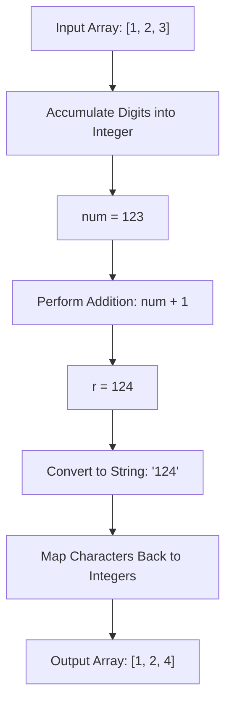

<h2><a href="https://leetcode.com/problems/plus-one">66. Plus One</a></h2>

<p>You are given a <strong>large integer</strong> represented as an integer array <code>digits</code>, where each <code>digits[i]</code> is the <code>i<sup>th</sup></code> digit of the integer. The digits are ordered from most significant to least significant in left-to-right order. The large integer does not contain any leading <code>0</code>'s.</p>

<p>Increment the large integer by one and return <em>the resulting array of digits</em>.</p>

<p>&nbsp;</p>
<p><strong class="example">Example 1:</strong></p>

<pre><strong>Input:</strong> digits = [1,2,3]
<strong>Output:</strong> [1,2,4]
<strong>Explanation:</strong> The array represents the integer 123.
Incrementing by one gives 123 + 1 = 124.
Thus, the result should be [1,2,4].
</pre>

<p><strong class="example">Example 2:</strong></p>

<pre><strong>Input:</strong> digits = [4,3,2,1]
<strong>Output:</strong> [4,3,2,2]
<strong>Explanation:</strong> The array represents the integer 4321.
Incrementing by one gives 4321 + 1 = 4322.
Thus, the result should be [4,3,2,2].
</pre>

<p><strong class="example">Example 3:</strong></p>

<pre><strong>Input:</strong> digits = [9]
<strong>Output:</strong> [1,0]
<strong>Explanation:</strong> The array represents the integer 9.
Incrementing by one gives 9 + 1 = 10.
Thus, the result should be [1,0].
</pre>

<p>&nbsp;</p>
<p><strong>Constraints:</strong></p>

<ul>
	<li><code>1 &lt;= digits.length &lt;= 100</code></li>
	<li><code>0 &lt;= digits[i] &lt;= 9</code></li>
	<li><code>digits</code> does not contain any leading <code>0</code>'s.</li>
</ul>


---

# 🛍️ Plus-One | Explained

## Approach 1: Reconstructing Integer via String & Type Conversions

### Intuition
The core idea behind this approach is to transform the array of individual digits back into its original scalar numerical value, perform standard arithmetic addition (+1), and then decompose the resulting integer back into an array of single-digit numbers.

Think of it like a bank vault with a combination lock consisting of multiple digit wheels. Instead of manually turning the last wheel and handling carries across neighboring wheels, you read the entire number off the lock, increment it by 1 using a standard calculator, and then re-set each individual wheel to match the calculated sum.

### Algorithm Visualized



### Approach
1. **Integer Reconstruction**: Iterate through the input array `digits` from left to right. Maintain a running tally `num` initialized to `0`. For each digit, shift `num` left by one decimal place (multiply by `10`) and add the current digit.
2. **Incrementation**: Add `1` to `num` and store the result in `r`.
3. **Decomposition**: Convert `r` into a string representation using `str()`.
4. **List Reconstruction**: Parse each character back into an integer using `map(int, ...)` and package the result into a list.
5. Return the newly created list.

### Detailed Code Analysis

```python
class Solution:
    def plusOne(self, digits: List[int]) -> List[int]:
        num = 0
        for i in digits:
            num = (num * 10) + i
        
        r = num + 1
        arr = list(map(int, str(r)))
        return arr
```

- **Lines 3–5 (`num = 0` & loop)**: The accumulator `num` accumulates the full integer representation. Python automatically handles arbitrarily large integers (bignum / multi-precision arithmetic), preventing standard integer overflow issues present in statically typed languages like C++ or Java. The expression `(num * 10) + i` mathematically simulates left-shifting digits in base-10.
- **Line 7 (`r = num + 1`)**: Adds `1` directly to the reconstructed BigInt representation.
- **Line 8 (`arr = list(map(int, str(r)))`)**: 
  - `str(r)` casts the integer into its base-10 string form (e.g., `124` becomes `"124"`).
  - `map(int, ...)` lazily iterates over each character of the string, converting characters back into integers (`'1'` $\rightarrow$ `1`, `'2'` $\rightarrow$ `2`, `'4'` $\rightarrow$ `4`).
  - `list(...)` evaluates the map generator into a standard Python list.
- **Line 9 (`return arr`)**: Returns the formatted array.

### Code

```python
class Solution:
    def plusOne(self, digits: List[int]) -> List[int]:
        num = 0
        for i in digits:
            num = (num * 10) + i
        
        r = num + 1
        arr = list(map(int, str(r)))
        return arr
```

### Complexity
- **Time Complexity:** $\mathcal{O}(N)$, where $N$ is the number of elements in the `digits` array.
  - Converting the array to an integer takes $\mathcal{O}(N)$ time.
  - Adding 1 to a BigInt takes $\mathcal{O}(N)$ arithmetic operations worst-case.
  - String conversion `str(r)` takes $\mathcal{O}(N)$ time (or $\mathcal{O}(N^2)$ for extremely large integers under certain CPython string conversion algorithms, though practically $\mathcal{O}(N)$ for constraint bounds).
  - Mapping characters back to integers and creating the list takes $\mathcal{O}(N)$ time.
- **Space Complexity:** $\mathcal{O}(N)$ auxiliary memory.
  - Creating the intermediate string `str(r)` allocates $\mathcal{O}(N)$ space.
  - Creating the output list `arr` allocates $\mathcal{O}(N)$ space.

---

## 🕵️‍♂️ Follow-up Questions

### 1. Why would this approach fail in typed languages like C++ or Java, and how would you optimize it?
**Answer:** In languages with fixed-size primitive types (e.g., 32-bit or 64-bit signed integers), reconstructive math breaks when `digits.length` exceeds 19 (the length of `LONG_MAX`). Since LeetCode constraints allow `digits.length` up to 100, integer overflow occurs.

To fix this, process the array directly from right to left using carry logic without converting to a single number:

```python
def plusOne(self, digits: List[int]) -> List[int]:
    for i in range(len(digits) - 1, -1, -1):
        if digits[i] < 9:
            digits[i] += 1
            return digits
        digits[i] = 0
    return [1] + digits
```
This optimized in-place approach runs in $\mathcal{O}(N)$ time and achieves $\mathcal{O}(1)$ auxiliary space complexity.

### 2. How does Python handle the arithmetic for an array with 1,000 digits?
**Answer:** Python automatically switches from fast primitive register operations to CPython's internal `PyLongObject` (arbitrary-precision integer arithmetic). While this prevents integer overflow, operations on gigantic integers require dynamic memory allocations and digit-by-digit operations under the hood, making type conversion approaches significantly slower and more memory-heavy than direct array manipulation.