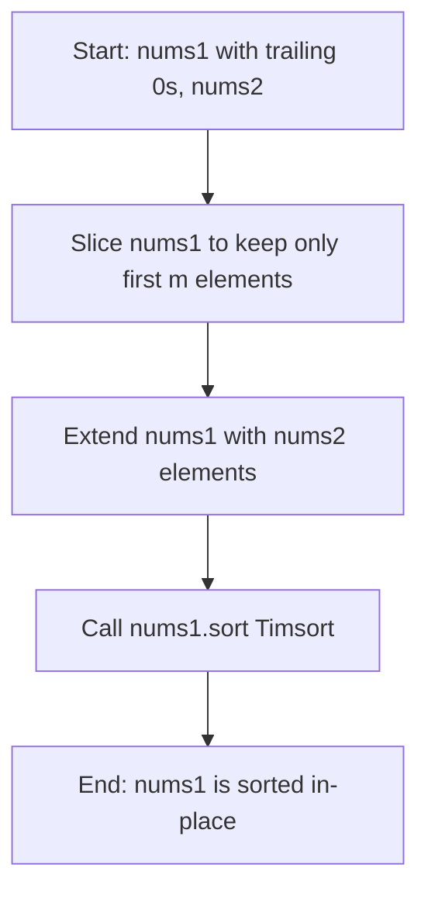
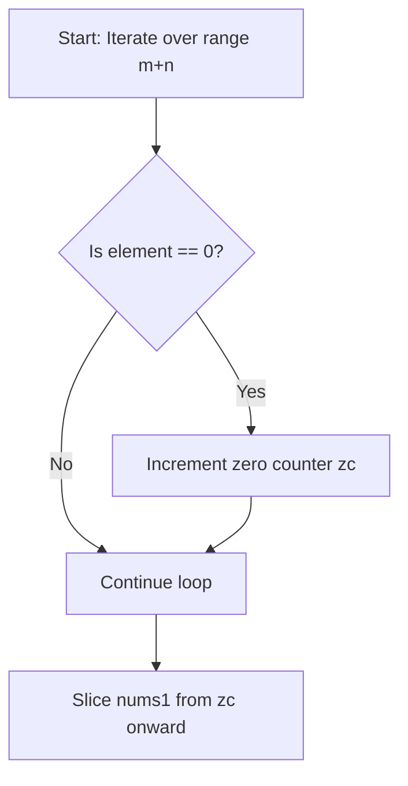

<h2><a href="https://leetcode.com/problems/merge-sorted-array">88. Merge Sorted Array</a></h2>

<p>You are given two integer arrays <code>nums1</code> and <code>nums2</code>, sorted in <strong>non-decreasing order</strong>, and two integers <code>m</code> and <code>n</code>, representing the number of elements in <code>nums1</code> and <code>nums2</code> respectively.</p>

<p><strong>Merge</strong> <code>nums1</code> and <code>nums2</code> into a single array sorted in <strong>non-decreasing order</strong>.</p>

<p>The final sorted array should not be returned by the function, but instead be <em>stored inside the array </em><code>nums1</code>. To accommodate this, <code>nums1</code> has a length of <code>m + n</code>, where the first <code>m</code> elements denote the elements that should be merged, and the last <code>n</code> elements are set to <code>0</code> and should be ignored. <code>nums2</code> has a length of <code>n</code>.</p>

<p>&nbsp;</p>
<p><strong class="example">Example 1:</strong></p>

<pre><strong>Input:</strong> nums1 = [1,2,3,0,0,0], m = 3, nums2 = [2,5,6], n = 3
<strong>Output:</strong> [1,2,2,3,5,6]
<strong>Explanation:</strong> The arrays we are merging are [1,2,3] and [2,5,6].
The result of the merge is [<u>1</u>,<u>2</u>,2,<u>3</u>,5,6] with the underlined elements coming from nums1.
</pre>

<p><strong class="example">Example 2:</strong></p>

<pre><strong>Input:</strong> nums1 = [1], m = 1, nums2 = [], n = 0
<strong>Output:</strong> [1]
<strong>Explanation:</strong> The arrays we are merging are [1] and [].
The result of the merge is [1].
</pre>

<p><strong class="example">Example 3:</strong></p>

<pre><strong>Input:</strong> nums1 = [0], m = 0, nums2 = [1], n = 1
<strong>Output:</strong> [1]
<strong>Explanation:</strong> The arrays we are merging are [] and [1].
The result of the merge is [1].
Note that because m = 0, there are no elements in nums1. The 0 is only there to ensure the merge result can fit in nums1.
</pre>

<p>&nbsp;</p>
<p><strong>Constraints:</strong></p>

<ul>
	<li><code>nums1.length == m + n</code></li>
	<li><code>nums2.length == n</code></li>
	<li><code>0 &lt;= m, n &lt;= 200</code></li>
	<li><code>1 &lt;= m + n &lt;= 200</code></li>
	<li><code>-10<sup>9</sup> &lt;= nums1[i], nums2[j] &lt;= 10<sup>9</sup></code></li>
</ul>

<p>&nbsp;</p>
<p><strong>Follow up: </strong>Can you come up with an algorithm that runs in <code>O(m + n)</code> time?</p>


---

# 🛍️ Merge-Sorted-Array | Explained

## Approach 1: Slice Truncation, Extension, and Timsort
### Intuition
Think of `nums1` as a bookshelf that has pre-allocated empty spaces (represented by zeros) at the end, and `nums2` as a stack of new books you need to add. Instead of carefully inserting each book one by one into its correct sorted place right away, this approach takes a shortcut: clear off the extra empty space on the shelf, dump all the new books onto the shelf, and then rearrange the entire shelf all at once.

### Algorithm Visualized


### Approach
1. **Truncate `nums1`:** Use slice assignment `nums1[:] = nums1[:m]` to retain only the valid initial `m` elements, dropping the trailing $0$ placeholders.
2. **Concatenate `nums2`:** Append all `n` elements from `nums2` to `nums1` using `nums1.extend(nums2)`.
3. **Sort in-place:** Call Python's built-in `.sort()` method on `nums1`, which uses Timsort to arrange all $m + n$ elements in non-decreasing order in-place.

### Detailed Code Analysis
- `nums1[:] = nums1[:m]`: Python creates a slice of the first `m` elements of `nums1` and assigns it back to `nums1` via slice assignment (`nums1[:]`). Slice assignment mutates the existing list object in-place rather than rebinding the variable name.
- `nums1.extend(nums2)`: Mutates `nums1` by appending each element from `nums2` to the end of `nums1`. The length of `nums1` becomes $m + n$.
- `nums1.sort()`: Executes Python's native Timsort algorithm directly on `nums1`. Timsort operates in $O(N \log N)$ time and modifies the list in-place.

### Code
```python
class Solution:
    def merge(self, nums1: List[int], m: int, nums2: List[int], n: int) -> None:
        nums1[:] = nums1[:m]
        nums1.extend(nums2)
        nums1.sort()
```

### Complexity
- **Time Complexity:** $\mathcal{O}((m + n) \log (m + n))$ — Truncating takes $\mathcal{O}(m)$ and extending takes $\mathcal{O}(n)$. The overall time complexity is dominated by `nums1.sort()`, which runs Timsort in $\mathcal{O}(K \log K)$ time where $K = m + n$.
- **Space Complexity:** $\mathcal{O}(m + n)$ or $\mathcal{O}(1)$ auxiliary depending on implementation details — Python's `nums1[:m]` creates a temporary slice of size $m$, and Timsort requires up to $\mathcal{O}(K)$ extra space during sorting.

---

## Approach 2: Linear Zero-Counting Post-Processing (Attempted/Commented Approach)
### Intuition
This approach reflects an alternative mental model attempting to handle trailing zeros by scanning the array after an operation, counting how many zeros exist, and slicing off that count from the front.

### Algorithm Visualized


### Approach
1. **Count Zeros:** Loop through the indices from `0` to `m + n - 1` and count every occurrence of the integer `0`.
2. **Shift/Slice:** Attempt to strip zeros from the front of `nums1` by taking the slice starting at index `zc` (`nums1[:]=nums1[zc:]`).

*(Note: As written, this logic assumes zeros are only prefix padding and does not validly merge `nums2` or handle non-zero elements properly, but it represents the commented-out logic in the code).*

### Detailed Code Analysis
- `zc = 0`: Initializes a counter variable for tracking the number of zero values encountered.
- `for i in range(m + n):`: Iterates across the indices of the array.
- `if nums1[i] == 0: zc += 1`: Checks if the element at index `i` is zero and increments the counter `zc`.
- `nums1[:] = nums1[zc:]`: Modifies `nums1` in-place by slicing from index `zc` to the end, removing the first `zc` elements.

### Code
```python
# Commented-out alternative logic extracted from the submission:
zc = 0
for i in range(m + n):
    if nums1[i] == 0:
        zc += 1
nums1[:] = nums1[zc:]
```

### Complexity
- **Time Complexity:** $\mathcal{O}(m + n)$ — Single linear scan over $m + n$ elements to count zeros, followed by an $\mathcal{O}(m + n)$ slice assignment.
- **Space Complexity:** $\mathcal{O}(m + n)$ — Slice creation `nums1[zc:]` allocates temporary memory proportional to the remaining elements.

---

## 🕵️‍♂️ Follow-up Questions (Optional)

**1. Can you solve this problem in $\mathcal{O}(m + n)$ time and $\mathcal{O}(1)$ extra space?**
> **Answer:** Yes, by using a **Three-Pointer / Reverse Fill** strategy. Since `nums1` has $m + n$ total capacity with unused space at the end, place three pointers: one at index $m-1$ (`p1`), one at index $n-1$ (`p2`), and one at index $m+n-1$ (`p`). Compare elements from the back and place the larger element at `p`, decrementing pointers accordingly.

**2. Why is slice assignment (`nums1[:] = ...`) required instead of standard variable assignment (`nums1 = ...`) in LeetCode?**
> **Answer:** Standard assignment `nums1 = ...` rebinds the local variable `nums1` to a new object in memory, leaving the caller's original list unchanged. Slice assignment `nums1[:] = ...` modifies the underlying memory buffer of the original list object in-place, which is required because the function signature returns `None`.