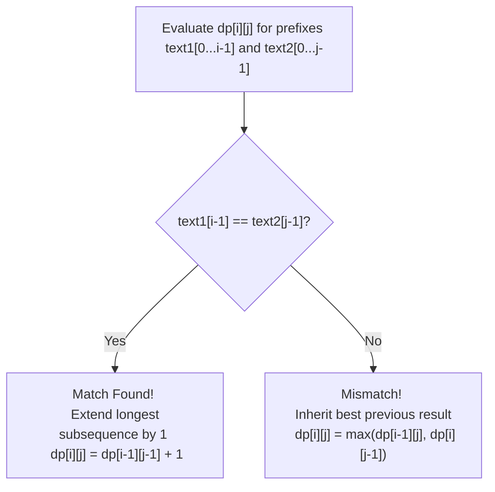

<h2><a href="https://leetcode.com/problems/longest-common-subsequence">1143. Longest Common Subsequence</a></h2>

<p>Given two strings <code>text1</code> and <code>text2</code>, return <em>the length of their longest <strong>common subsequence</strong>. </em>If there is no <strong>common subsequence</strong>, return <code>0</code>.</p>

<p>A <strong>subsequence</strong> of a string is a new string generated from the original string with some characters (can be none) deleted without changing the relative order of the remaining characters.</p>

<ul>
	<li>For example, <code>"ace"</code> is a subsequence of <code>"abcde"</code>.</li>
</ul>

<p>A <strong>common subsequence</strong> of two strings is a subsequence that is common to both strings.</p>

<p>&nbsp;</p>
<p><strong class="example">Example 1:</strong></p>

<pre><strong>Input:</strong> text1 = "abcde", text2 = "ace" 
<strong>Output:</strong> 3  
<strong>Explanation:</strong> The longest common subsequence is "ace" and its length is 3.
</pre>

<p><strong class="example">Example 2:</strong></p>

<pre><strong>Input:</strong> text1 = "abc", text2 = "abc"
<strong>Output:</strong> 3
<strong>Explanation:</strong> The longest common subsequence is "abc" and its length is 3.
</pre>

<p><strong class="example">Example 3:</strong></p>

<pre><strong>Input:</strong> text1 = "abc", text2 = "def"
<strong>Output:</strong> 0
<strong>Explanation:</strong> There is no such common subsequence, so the result is 0.
</pre>

<p>&nbsp;</p>
<p><strong>Constraints:</strong></p>

<ul>
	<li><code>1 &lt;= text1.length, text2.length &lt;= 1000</code></li>
	<li><code>text1</code> and <code>text2</code> consist of only lowercase English characters.</li>
</ul>


---

# 🛍️ Longest-Common-Subsequence | Explained

## Approach 1: Bottom-Up 2D Dynamic Programming (Tabulation)

### Intuition
Think of comparing two historical manuscripts or DNA sequences to find their common structural backbone. If you are comparing two manuscripts word by word, whenever you find an identical word in both manuscripts at your current reading positions, you can permanently lock that match in and increment your total match count by 1. Your total progress then depends on the best result you achieved *before* reaching those two matching words.

However, if the words at your current positions do not match, you face a choice: either skip the current word in the first manuscript and see if the second manuscript matches the rest of the text, or skip the current word in the second manuscript and see if the first manuscript matches. To maximize your total matches, you take the optimal choice (the maximum count) between these two scenarios. 

This optimal substructure allows us to build the solution incrementally from smaller string prefixes up to the full length of both input strings.

### Algorithm Visualized



---

### Approach
1. **Dimensions & Base Cases:**
   - Define $n$ as the length of `text1` and $m$ as the length of `text2`.
   - Allocate a 2D table `dp` of size $(n + 1) \times (m + 1)$, initialized entirely with `0`.
   - `dp[i][j]` represents the length of the Longest Common Subsequence between the prefix `text1[0...i-1]` and `text2[0...j-1]`.
   - The 0th row and 0th column act as base cases: comparing any string prefix with an empty string yields an LCS of length `0`.

2. **State Transitions:**
   - Iterate through `text1` with index `i` (from `1` to `n`) and `text2` with index `j` (from `1` to `m`).
   - **Case 1 (Character Match):** If `text1[i-1] == text2[j-1]`, the current characters contribute `1` to the LCS length formed by the prefixes excluding these characters:
     $$\text{dp}[i][j] = \text{dp}[i-1][j-1] + 1$$
   - **Case 2 (Character Mismatch):** If `text1[i-1] != text2[j-1]`, the current characters cannot both be part of the same matching pair. We drop one character at a time and take the maximum:
     $$\text{dp}[i][j] = \max(\text{dp}[i-1][j], \text{dp}[i][j-1])$$

3. **Result:**
   - The final answer is stored in `dp[n][m]`, representing the LCS length for the complete strings `text1` and `text2`.

---

### Detailed Code Analysis

```python
1class Solution:
2    def longestCommonSubsequence(self, text1: str, text2: str) -> int:
```
* **Lines 1–2:** Defines the standard LeetCode `Solution` class and method signature. `text1` and `text2` are the input strings, and the return type is an integer representing the maximum LCS length.

```python
3        n = len(text1)
4        m = len(text2)
```
* **Lines 3–4:** Computes and stores the lengths of `text1` and `text2` as `n` and `m` respectively.

```python
7        dp= [[0] * (m+1) for _ in range(n+1)]
```
* **Line 7:** Constructing the 2D DP array.
  * Size: $(n + 1)$ rows and $(m + 1)$ columns.
  * We add $+1$ to handle 1-based indexing for prefixes. This avoids out-of-bounds checks when referencing `i-1` or `j-1` at index `1` (which maps to index `0` of the input strings).
  * Space is allocated using list comprehension to ensure distinct row arrays are created in memory.

```python
9        for i in range(1,n+1):
10            for j in range(1,m+1):
```
* **Lines 9–10:** Outer loop iterates through string `text1` (length index `i`), and inner loop iterates through `text2` (length index `j`).

```python
11                if text1[i-1] == text2[j-1]:
12                    dp[i][j] = dp[i-1][j-1] + 1
```
* **Lines 11–12:** 0-indexed character comparison. `i-1` corresponds to the current character in `text1` and `j-1` corresponds to `text2`.
* If they match, we lookup the top-left diagonal value `dp[i-1][j-1]` (the LCS of both strings prior to adding these characters) and add `1`.

```python
13                else:
14                    dp[i][j] = max(dp[i - 1][j], dp[i][j - 1])
```
* **Lines 13–14:** Handles character mismatch.
  * `dp[i-1][j]` represents ignoring the current character of `text1`.
  * `dp[i][j-1]` represents ignoring the current character of `text2`.
  * We assign the maximum value of these two subproblems to `dp[i][j]`.

```python
16        return dp[n][m]
```
* **Line 16:** Returns the value computed at the bottom-right corner of the table, which contains the LCS length for full lengths `n` and `m`.

---

### Code

```python
class Solution:
    def longestCommonSubsequence(self, text1: str, text2: str) -> int:
        n = len(text1)
        m = len(text2)

        dp = [[0] * (m + 1) for _ in range(n + 1)]

        for i in range(1, n + 1):
            for j in range(1, m + 1):
                if text1[i - 1] == text2[j - 1]:
                    dp[i][j] = dp[i - 1][j - 1] + 1
                else:
                    dp[i][j] = max(dp[i - 1][j], dp[i][j - 1])
            
        return dp[n][m]
```

---

### Complexity
- **Time Complexity:** $\mathcal{O}(n \times m)$
  - Nested loops run $n$ times and $m$ times respectively. Inside the inner loop, all operations (lookups, comparisons, basic arithmetic) run in $\mathcal{O}(1)$ time. Thus, the total runtime scales directly with the product of the lengths of both strings.
- **Space Complexity:** $\mathcal{O}(n \times m)$
  - We instantiate a full 2D table of dimensions $(n + 1) \times (m + 1)$ to store intermediate subproblem state values.

---

## 🕵️‍♂️ Follow-up Questions

### 1. How would you optimize the Space Complexity from $\mathcal{O}(n \times m)$ to $\mathcal{O}(\min(n, m))$?
**Answer:** Notice that to compute any row `i` in the DP table, we only ever reference values from the current row `i` and the immediately preceding row `i-1`. 

Instead of maintaining the entire 2D matrix, we can keep just two 1D arrays of size $m + 1$ (or even a single 1D array with a temporary variable storing the top-left diagonal value). By always picking the shorter string to represent the columns, the space complexity reduces significantly to $\mathcal{O}(\min(n, m))$.

### 2. How would you return the actual LCS string instead of just its length?
**Answer:** After filling out the DP table, we start at cell `dp[n][m]` and backtrack towards `dp[0][0]`:
1. If `text1[i-1] == text2[j-1]`, append `text1[i-1]` to our result collector and move diagonally to `(i-1, j-1)`.
2. Otherwise, look at the adjacent cells `dp[i-1][j]` and `dp[i][j-1]` and move in the direction of whichever cell holds the larger value.
3. Once we hit row `0` or column `0`, reverse the collected characters to get the actual LCS string.