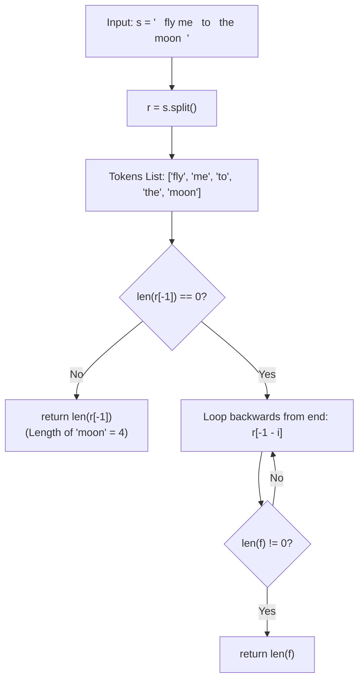

<h2><a href="https://leetcode.com/problems/length-of-last-word">58. Length of Last Word</a></h2>

<p>Given a string <code>s</code> consisting of words and spaces, return <em>the length of the <strong>last</strong> word in the string.</em></p>

<p>A <strong>word</strong> is a maximal <span data-keyword="substring-nonempty" class=" cursor-pointer relative text-dark-blue-s text-sm"><button type="button" aria-haspopup="dialog" aria-expanded="false" aria-controls="radix-_r_s5_" data-state="closed" class="">substring</button></span> consisting of non-space characters only.</p>

<p>&nbsp;</p>
<p><strong class="example">Example 1:</strong></p>

<pre><strong>Input:</strong> s = "Hello World"
<strong>Output:</strong> 5
<strong>Explanation:</strong> The last word is "World" with length 5.
</pre>

<p><strong class="example">Example 2:</strong></p>

<pre><strong>Input:</strong> s = "   fly me   to   the moon  "
<strong>Output:</strong> 4
<strong>Explanation:</strong> The last word is "moon" with length 4.
</pre>

<p><strong class="example">Example 3:</strong></p>

<pre><strong>Input:</strong> s = "luffy is still joyboy"
<strong>Output:</strong> 6
<strong>Explanation:</strong> The last word is "joyboy" with length 6.
</pre>

<p>&nbsp;</p>
<p><strong>Constraints:</strong></p>

<ul>
	<li><code>1 &lt;= s.length &lt;= 10<sup>4</sup></code></li>
	<li><code>s</code> consists of only English letters and spaces <code>' '</code>.</li>
	<li>There will be at least one word in <code>s</code>.</li>
</ul>


---

# 🛍️ Length-of-Last-Word | Explained

## Approach 1: Whitespace Splitting with Defensive Backwards Scan
### Intuition
Imagine you have a long sentence written on a ribbon. To find the last word, you take a pair of scissors and cut the ribbon at every space, creating a pile of word fragments laid out in order. 

Under ideal conditions, the very last piece of paper at the end of the line is the word you are looking for, and you can simply measure its length. However, if trailing spaces or formatting quirks produced blank slips of paper at the end, you would look at the final slip, realize it is blank, and then scan backwards through the slips one by one until your fingers touch the first real word. 

### Algorithm Visualized


### Approach
1. **Tokenize the String**: Break the input string `s` into a list of word tokens `r` using Python's built-in string splitting mechanism.
2. **Inspect the Final Token**: Access the last element in the list using the index `r[-1]`.
3. **Handle Edge/Empty Tokens**:
   - Check if the last token is empty (`len(r[-1]) == 0`). 
   - If it is empty, iterate backwards through the list indices from right to left using the negative offset `-1 - i`.
   - As soon as a token with a non-zero length is encountered, immediately return its length.
4. **Fast Path**: If the last element is already a non-empty word, skip the loop entirely and return `len(r[-1])`.

### Detailed Code Analysis
- **Lines 3–4 (`r = []`, `r = s.split( )`)**: Line 3 initializes an empty list `r`, which is immediately overwritten on Line 4 by the result of `s.split( )`. In Python, calling `.split()` (even with whitespace inside the call expression) splits by consecutive whitespace runs and strips leading/trailing whitespaces.
- **Line 5 (`if len(r[-1]) == 0:`)**: This acts as a defensive guard. If splitting were to preserve trailing delimiters (as seen with `split(' ')`), the last element `r[-1]` could be an empty string `""`.
- **Lines 6–9 (`for i in range(len(r)): ... return len(f)`)**: 
  - Iterates `i` from `0` to `len(r) - 1`.
  - Computes `f = r[-1 - i]`, which walks backward: `r[-1]`, `r[-2]`, `r[-3]`, etc.
  - Checks if `len(f) != 0`. The first non-empty word found from the back is returned immediately.
- **Lines 11–12 (`else: return len(r[-1])`)**: When the last token is valid and non-empty, the algorithm bypasses the reverse loop and directly evaluates the length of `r[-1]`.

### Code
```python
class Solution:
    def lengthOfLastWord(self, s: str) -> int:
        r = []
        r = s.split( )
        if len(r[-1]) == 0:
            for i in range(len(r)):
                f = r[-1 - i]
                if len(f) != 0:
                    return len(f)
        else:
            return len(r[-1])
```

### Complexity
- **Time Complexity:** $\mathcal{O}(N)$, where $N$ is the total number of characters in the string `s`. 
  - `s.split()` scans through the entire string of length $N$ to partition words.
  - The fallback `for` loop runs at most $K$ iterations (where $K$ is the number of tokens, $K \le N$).
  - Overall time remains strictly linear: $\mathcal{O}(N)$.
- **Space Complexity:** $\mathcal{O}(N)$. 
  - `s.split()` constructs a list of substrings that in the worst case (e.g., words separated by single spaces) stores all characters from the original string, consuming $\mathcal{O}(N)$ dynamic memory.

---

## 🕵️‍♂️ Follow-up Questions (Optional)

1. **How can you optimize this solution to $\mathcal{O}(1)$ auxiliary space?**
   Instead of splitting the entire string and allocating memory for an array of tokens, you can traverse the string in reverse using a two-pointer approach:
   - Start an index pointer at the end of the string (`len(s) - 1`).
   - Decrement the pointer to skip all trailing whitespace characters.
   - Count consecutive non-whitespace characters until the next space or the start of the string is reached.

2. **What potential runtime hazard exists on an empty or all-whitespace