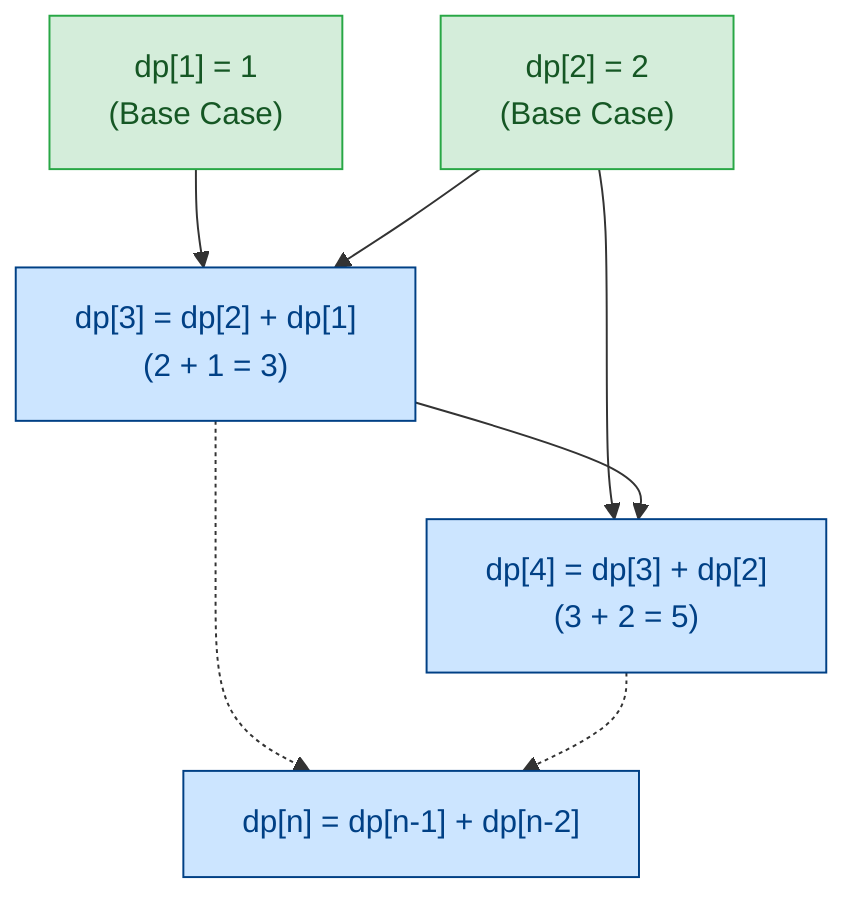

<h2><a href="https://leetcode.com/problems/climbing-stairs">70. Climbing Stairs</a></h2>

<p>You are climbing a staircase. It takes <code>n</code> steps to reach the top.</p>

<p>Each time you can either climb <code>1</code> or <code>2</code> steps. In how many distinct ways can you climb to the top?</p>

<p>&nbsp;</p>
<p><strong class="example">Example 1:</strong></p>

<pre><strong>Input:</strong> n = 2
<strong>Output:</strong> 2
<strong>Explanation:</strong> There are two ways to climb to the top.
1. 1 step + 1 step
2. 2 steps
</pre>

<p><strong class="example">Example 2:</strong></p>

<pre><strong>Input:</strong> n = 3
<strong>Output:</strong> 3
<strong>Explanation:</strong> There are three ways to climb to the top.
1. 1 step + 1 step + 1 step
2. 1 step + 2 steps
3. 2 steps + 1 step
</pre>

<p>&nbsp;</p>
<p><strong>Constraints:</strong></p>

<ul>
	<li><code>1 &lt;= n &lt;= 45</code></li>
</ul>


---

# 🛍️ Climbing-Stairs | Explained

## Approach 1: Bottom-Up Dynamic Programming (Tabulation)
### Intuition
Imagine you are standing at the base of a staircase, trying to reach step $n$. At any given step $i$, the rules allow you to move forward either by 1 step or by 2 steps. Working backwards, to land on step $i$, your immediate previous position must have been either step $i-1$ (taking a 1-step hop) or step $i-2$ (taking a 2-step hop). 

Because these two arrival paths are mutually exclusive and encompass all possible valid moves onto step $i$, the total number of distinct ways to reach step $i$ is simply the sum of the total ways to reach step $i-1$ and the total ways to reach step $i-2$. This forms the classic Fibonacci sequence pattern ($F(n) = F(n-1) + F(n-2)$), solved efficiently here using bottom-up dynamic programming via tabulation.

### Algorithm Visualized


### Approach
1. **DP Array Allocation**: Create a table `dp` initialized with zeros of size $n + 2$. Allocating $n + 2$ elements prevents out-of-bounds indexing errors when initializing base cases for small inputs like $n = 1$.
2. **Base Case Setup**: Pre-fill the base values:
   - `dp[1] = 1`: There is 1 distinct way to reach step 1 (take 1 step).
   - `dp[2] = 2`: There are 2 distinct ways to reach step 2 (1 step + 1 step, or 2 steps directly).
3. **Guard Clauses for Base Inputs**: Check if $n == 1$ or $n == 2$ to return early.
4. **Iterative Tabulation**: For values of $n \ge 3$, loop from $3$ up to $n$ (inclusive). Compute each state using the transition equation:
   $$\text{dp}[i] = \text{dp}[i-1] + \text{dp}[i-2]$$
5. **Result Extraction**: Return `dp[n]`, which holds the aggregated number of total distinct ways to reach the $n$-th step.

### Detailed Code Analysis

Let's dissect the implementation line by line:

```python
dp = [0] * (n + 2)
```
* **Line 4**: Instantiates an array `dp` of size `n + 2` filled with zeros. The additional size overhead (`+ 2`) is a defensive measure so that index `2` is always valid in memory even when $n = 1$.

```python
dp[1] = 1
dp[2] = 2
```
* **Lines 6–7**: Explicitly sets the base cases for $dp[1]$ and $dp[2]$. Notice this assignment runs unconditionally before checking the value of `n`.

```python
if n == 1:
    return 1
elif n == 2:
    return 2
```
* **Lines 9–12**: Evaluates edge cases where $n$ is either $1$ or $2$. Returns static integer answers immediately, bypassing loop execution.

```python
else:
    for i in range(3, n + 1):
        dp[i] = dp[i - 1] + dp[i - 2]
    
    return dp[n]
```
* **Lines 13–17**: If $n \ge 3$, the code enters the `else` block:
  * `range(3, n + 1)` iterates through all step indices from $3$ up to $n$.
  * `dp[i] = dp[i - 1] + dp[i - 2]` populates the current index by adding the solutions of the two prior subproblems.
  * `return dp[n]` returns the accumulated total stored at position `n`.

### Code
```python
class Solution:
    def climbStairs(self, n: int) -> int:

        dp = [0] * (n + 2)

        dp[1] = 1
        dp[2] = 2

        if n == 1:
            return 1
        elif n == 2:
            return 2
        else:
            for i in range(3, n + 1):
                dp[i] = dp[i - 1] + dp[i - 2]
        
            return dp[n]
```

### Complexity
- **Time Complexity:** $\mathcal{O}(n)$ — The `for` loop executes $n - 2$ times when $n \ge 3$. Inside the loop, state lookup and addition run in constant time $\mathcal{O}(1)$.
- **Space Complexity:** $\mathcal{O}(n)$ — The primary memory overhead comes from allocating the `dp` list of length $n + 2$.

---

## 🕵️‍♂️ Follow-up Questions (Optional)

### 1. How would you optimize the Space Complexity from $\mathcal{O}(n)$ to $\mathcal{O}(1)$?
**Answer:** Notice that calculating `dp[i]` only ever requires access to the immediate two previous states (`dp[i-1]` and `dp[i-2]`). We don't need to keep the entire historical array in memory. We can replace the array with two scalar variables (`prev1` and `prev2`) and update them iteratively:

```python
class Solution:
    def climbStairs(self, n: int) -> int:
        if n <= 2:
            return n
        
        prev2, prev1 = 1, 2
        for _ in range(3, n + 1):
            curr = prev1 + prev2
            prev2 = prev1
            prev1 = curr
            
        return prev1
```
This reduces auxiliary space to $\mathcal{O}(1)$ while maintaining $\mathcal{O}(n)$ time complexity.

### 2. What if a climber could take up to $k$ steps at a time instead of just 1 or 2?
**Answer:** The state transition generalizes to summing the previous $k$ steps:
$$\text{dp}[i] = \sum_{j=1}^{k} \text{dp}[i-j]$$

Using a nested loop or a sliding window sum, this generalized version can be solved in $\mathcal{O}(n \cdot k)$ time with a sliding window approach optimizing it down to $\mathcal{O}(n)$ time complexity.