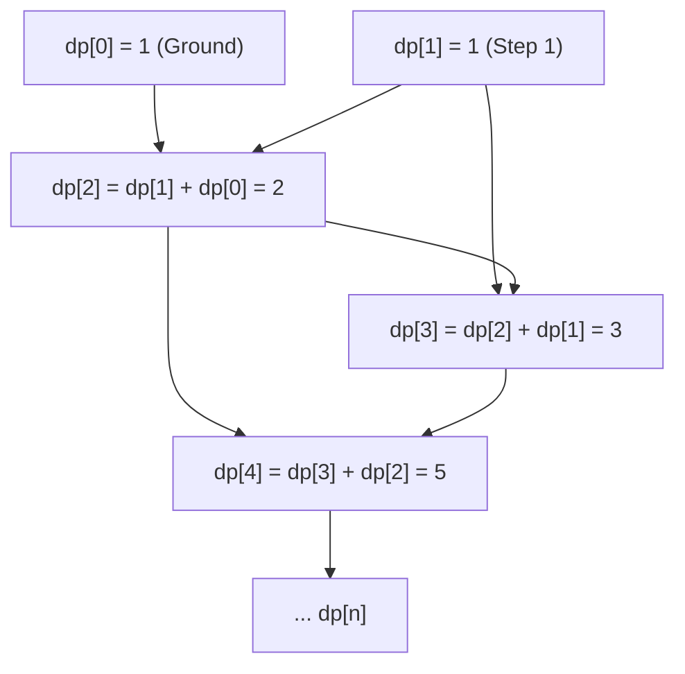

<h2><a href="https://leetcode.com/problems/climbing-stairs">70. Climbing Stairs</a></h2>

<p>You are climbing a staircase. It takes <code>n</code> steps to reach the top.</p>

<p>Each time you can either climb <code>1</code> or <code>2</code> steps. In how many distinct ways can you climb to the top?</p>

<p>&nbsp;</p>
<p><strong class="example">Example 1:</strong></p>

<pre><strong>Input:</strong> n = 2
<strong>Output:</strong> 2
<strong>Explanation:</strong> There are two ways to climb to the top.
1. 1 step + 1 step
2. 2 steps
</pre>

<p><strong class="example">Example 2:</strong></p>

<pre><strong>Input:</strong> n = 3
<strong>Output:</strong> 3
<strong>Explanation:</strong> There are three ways to climb to the top.
1. 1 step + 1 step + 1 step
2. 1 step + 2 steps
3. 2 steps + 1 step
</pre>

<p>&nbsp;</p>
<p><strong>Constraints:</strong></p>

<ul>
	<li><code>1 &lt;= n &lt;= 45</code></li>
</ul>


---

# 🛍️ Climbing-Stairs | Explained

## Approach 1: Bottom-Up Dynamic Programming (Tabulation)
### Intuition
Imagine you are standing at the base of a flight of stairs and want to reach the $n$-th step. At any step $i$, you could have only arrived from one of two places: step $i - 1$ (by taking a single 1-step leap) or step $i - 2$ (by taking a 2-step leap). 

Because these two possibilities are mutually exclusive and cover every valid way to reach step $i$, the total number of distinct ways to reach step $i$ is simply the sum of the distinct ways to reach step $i - 1$ and step $i - 2$. This matches the classic Fibonacci recurrence:
$$\text{ways}(i) = \text{ways}(i - 1) + \text{ways}(i - 2)$$

Instead of recalculating these values repeatedly via recursion, we build a table from the ground up starting from the base cases ($0$ and $1$).

### Algorithm Visualized

```mermaid
flowchart TD
    A["dp[0] = 1 (Ground)"] --> C["dp[2] = dp[1] + dp[0] = 2"]
    B["dp[1] = 1 (Step 1)"] --> C
    B --> D["dp[3] = dp[2] + dp[1] = 3"]
    C --> D
    C --> E["dp[4] = dp[3] + dp[2] = 5"]
    D --> E
    E --> F["... dp[n]"]
```

### Approach
1. **Handle Base Cases Early:** If $n \le 1$, return $1$ immediately, as there is only 1 way to reach the ground (0 steps: do nothing) or 1 step (1 single step).
2. **Allocate State Array:** Initialize an array `dp` of size $n + 1$ with zeros to store the number of ways to reach each step from $0$ to $n$.
3. **Seed Known Values:** Set `dp[0] = 1` and `dp[1] = 1`.
4. **Iterative Transition:** Iterate through each step $i$ from $2$ up to $n$, populating `dp[i]` by adding `dp[i - 1]` and `dp[i - 2]`.
5. **Extract Result:** The value at `dp[n]` holds the total distinct ways to reach step $n$.

### Detailed Code Analysis
- `if n <= 1: return 1`  
  Guards against edge cases where $n = 0$ or $n = 1$. It prevents unnecessary array allocations and handles minimal input values in $O(1)$ time.
- `dp = [0] * (n + 1)`  
  Allocates a list of size $n + 1$. An index corresponds directly to the step number (from $0$ to $n$), which avoids off-by-one indexing adjustments.
- `dp[0] = 1` and `dp[1] = 1`  
  Establishes the boundary conditions:
  - `dp[0] = 1`: There is 1 way to stay at the ground (take 0 steps). This mathematical convention ensures `dp[2] = dp[1] + dp[0] = 1 + 1 = 2` calculates correctly.
  - `dp[1] = 1`: There is only 1 way to reach step 1 (a single 1-step move).
- `for i in range(2, n + 1):`  
  Runs a loop from step $2$ through step $n$, visiting every subproblem in increasing order of complexity.
- `dp[i] = dp[i - 1] + dp[i - 2]`  
  Applies the state transition formula. Each entry resolves in $O(1)$ time by reusing previously computed answers stored in the table.
- `return dp[n]`  
  *(Note on indentation: In the provided raw snippet, `return dp[n]` was placed with inner indentation. Semantically and logically in Python, it must sit outside the loop).* Returns the fully computed number of ways to reach step $n$.

### Code
```python
class Solution:
    def climbStairs(self, n: int) -> int:
        if n <= 1:
            return 1
        
        dp = [0] * (n + 1)
        dp[0] = 1
        dp[1] = 1
        
        for i in range(2, n + 1):
            dp[i] = dp[i - 1] + dp[i - 2]
            
        return dp[n]
```

### Complexity
- **Time:** $O(n)$ — The algorithm executes a single `for` loop that runs from $2$ to $n$. Each iteration performs an $O(1)$ addition and array access.
- **Space:** $O(n)$ — A dynamic programming array of size $n + 1$ is allocated in memory to store the intermediate states.

## 🕵️‍♂️ Follow-up Questions (Optional)

1. **Can this solution be optimized to $O(1)$ auxiliary space?**
   - **Answer:** Yes. Notice that computing `dp[i]` only depends on the previous two values (`dp[i - 1]` and `dp[i - 2]`). Instead of maintaining an entire list of size $n + 1$, we can maintain two variables (e.g., `prev1` and `prev2`) and update them iteratively, reducing space complexity from $O(n)$ to $O(1)$.

2. **Can we achieve a time complexity faster than $O(n)$?**
   - **Answer:** Yes. Since the transition represents the standard Fibonacci recurrence $\begin{pmatrix} F_{k+1} \\ F_k \end{pmatrix} = \begin{pmatrix} 1 & 1 \\ 1 & 0 \end{pmatrix} \begin{pmatrix} F_k \\ F_{k-1} \end{pmatrix}$, we can use **Matrix Exponentiation** to compute the $n$-th state in $O(\log n)$ time, or use Binet's closed-form formula in $O(1)$ time (subject to floating-point precision limits).